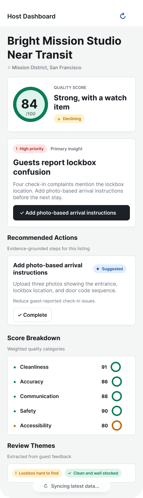
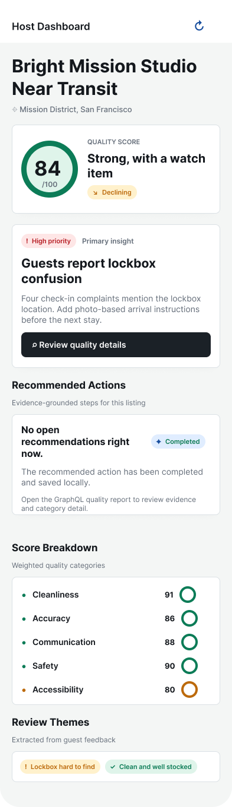
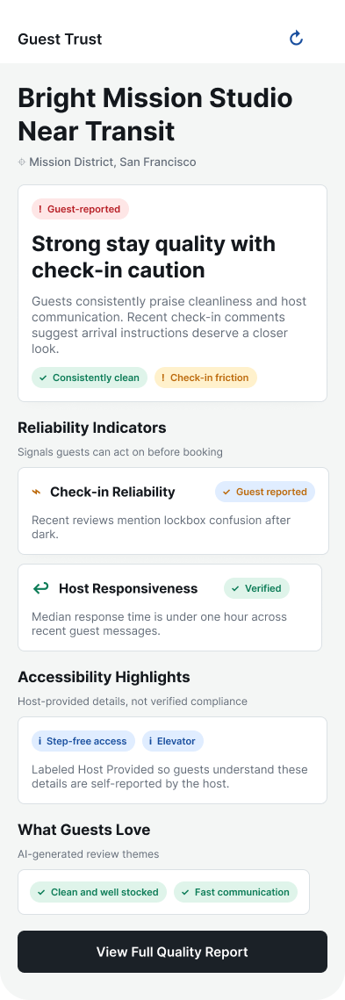
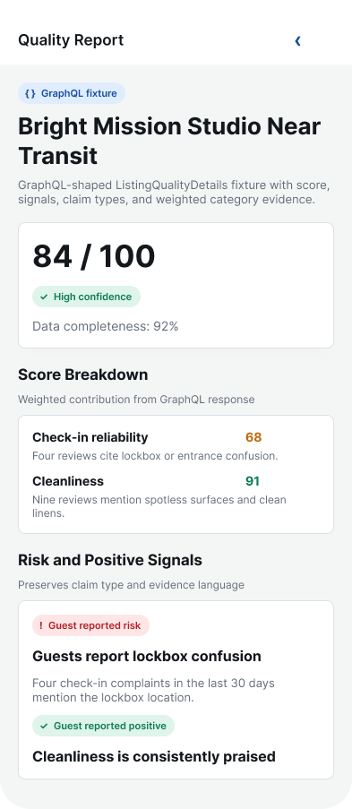
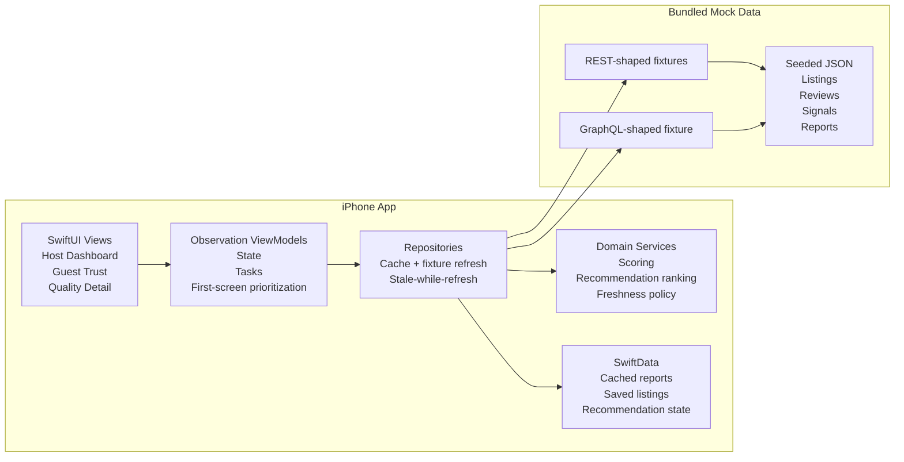
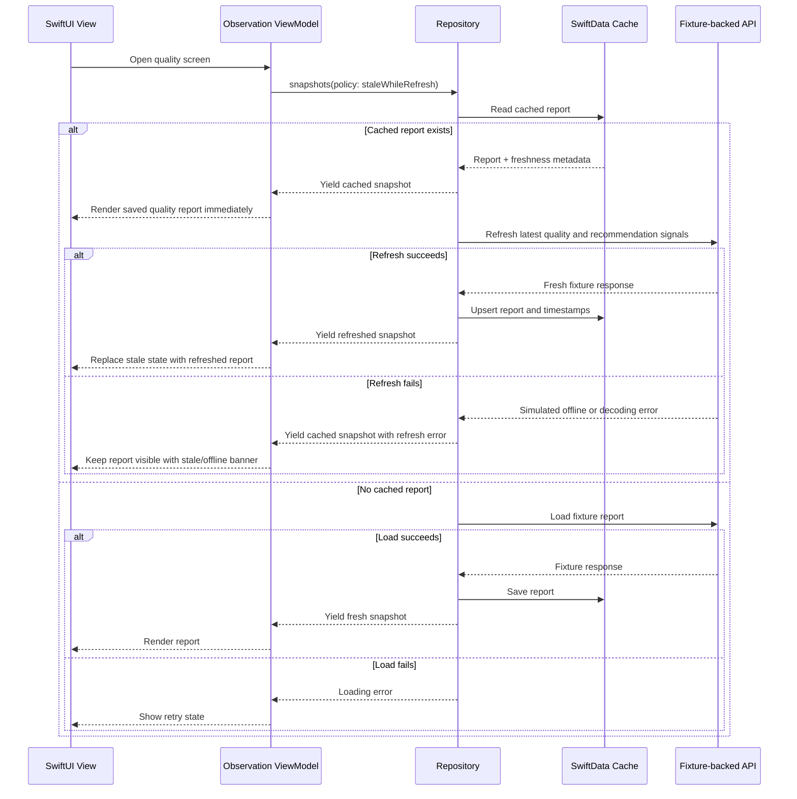

# ListingLens

ListingLens is an iPhone-first SwiftUI portfolio project for stay-quality, host reputation, and guest trust insights. It models a simplified Quality Reputation product: collect listing, review, reliability, accessibility, and support signals; turn them into explainable quality reports; then help hosts take the next best action while giving guests a clearer trust summary.

The project is designed for the Airbnb Software Engineer, New Grad role on a Quality Reputation-style team. It emphasizes customer-facing product quality, proactive intervention, offline-aware iOS engineering, explainable scoring, accessibility, and cross-functional judgment.

## Highlights

- Host Dashboard and Guest Trust flows built with SwiftUI, Swift Observation, and typed ViewModels.
- SwiftData-backed stale-while-refresh repository logic renders cached listing data immediately, then refreshes bundled API data in the background.
- REST-shaped mock API fixtures power listing summaries and quality report loading through typed `Decodable` DTOs.
- GraphQL-shaped `ListingQualityDetails` fixture powers the full Quality Report detail screen.
- Accessibility-conscious trust badges use icon plus text and preserve claim type: verified, host-provided, guest-reported, or inferred.
- Swift Testing unit coverage exercises scoring, fixture decoding, repository streaming, and ViewModel behavior.
- GitHub Actions CI runs SwiftLint plus Xcode build/test on macOS.

Design reference: [ListingLens Figma component and screen file](https://www.figma.com/design/Zlo4IFwAXEm4W94z1HyRCf/ListingLens-Shared-UI-Components?node-id=0-1&t=srHFpb4e3CbVgGmz-1)

## App Preview

These previews are Figma-rendered views of the implemented app screens. They are included here because the dashboard pages are taller than a single simulator viewport, while the live app remains the source of truth for behavior.

| Host Dashboard | Host Completed State |
| --- | --- |
|  |  |

| Guest Trust | Quality Report Detail |
| --- | --- |
|  |  |

## Quick Start

1. Open `ListingLens.xcodeproj` in Xcode.
2. Select the `ListingLens` scheme and an iPhone simulator.
3. Run the app.
4. Use the bottom tabs:
   - `Host`: review the host-facing quality score, stale-data behavior, primary insight, recommendations, score breakdown, and review themes.
   - `Guest`: review the guest-facing trust summary, reliability indicators, host-provided accessibility highlights, review themes, and the GraphQL-backed full quality report.

## Why This Project

Airbnb's Quality Reputation work sits at the intersection of trust, safety, supply quality, and user experience. ListingLens demonstrates that same product shape in a focused MVP:

- Hosts see quality risks before they become repeated guest issues.
- Guests see explainable trust signals instead of relying only on average ratings.
- Recommendations are evidence-grounded, not black-box advice.
- Cached quality reports render immediately while the latest safety and recommendation refresh runs in the background.
- The app avoids overclaiming: badges distinguish verified, host-provided, guest-reported, and inferred signals.

## MVP Technical Choices

The goal is to finish quickly enough to apply and move on, while still showing disciplined engineering.

| Decision | Choice | Why it helps speed | Why it still shows quality |
| --- | --- | --- | --- |
| Data source | Bundled JSON fixtures with an injectable mock API layer | No backend deployment, auth, database, or local server setup | Still uses typed clients, DTO decoding, async flows, errors, retries, and repository boundaries |
| State management | Swift Observation | Less boilerplate than older ObservableObject patterns | Modern SwiftUI architecture with clear ViewModel ownership |
| Storage | SwiftData + UserDefaults via `@AppStorage` | Fast modern persistence setup | Structured cache models, timestamps, stale data metadata, saved recommendation state, and restored persona selection |
| Platform | iPhone-only MVP | Avoids iPad layout expansion | Lets the core host/guest flows get polished instead of stretched thin |
| AI layer | Deterministic AI Quality Coach | No API key, cost, latency, or LLM integration risk | Recommendations remain explainable, testable, and grounded in visible evidence |
| Networking | REST-shaped fixtures + one GraphQL-shaped quality detail query | No backend complexity | Demonstrates REST and GraphQL modeling without scope creep |
| Testing | Swift Testing | Native WWDC24-era test syntax | Focused tests for scoring, decoding, repositories, and ViewModel state |

## Core Product Flows

### Host Dashboard

- Overall quality score with confidence and data completeness.
- Primary insight derived from the highest-priority risk or recommendation.
- Top risk signal and primary recommended action on the first screen.
- Drill-down sections for review themes, positive signals, risk signals, and score breakdowns.
- Deterministic AI Quality Coach suggestions with evidence, expected impact, confidence, and claim type.
- Recommendation state is local and predictable: hosts can complete actions, SwiftData persists the result, and refreshed fixture data is merged without overwriting local completion state.

### Guest Trust View

- Listing trust summary.
- Check-in reliability.
- Accessibility completeness, clearly labeled as information completeness unless verified.
- Strongest positive or caution signal.
- Badge explanations tied to visible supporting evidence.

### Quality Report Detail

- Category scores for cleanliness, accuracy, check-in, communication, cancellation reliability, safety signals, and accessibility completeness.
- Confidence and data completeness metadata.
- Risk and positive signals.
- GraphQL-shaped detail query backed by bundled fixtures.

## Architecture Overview

## Stale-While-Refresh Trust Pattern

ListingLens uses stale-while-refresh for quality reports because trust and safety products should show the best available information immediately. A host or guest should not stare at a blank screen just because the latest safety-signal refresh is still running.

This pattern demonstrates offline support, async programming, local persistence, error handling, and user-centered trust design in one flow.

## Quality and Fairness Principles

- Every recommendation must cite evidence.
- Every badge must have an explanation.
- Accessibility completeness means information completeness unless verified evidence exists.
- The quality score includes confidence and data completeness metadata.
- MVP scoring weights are heuristic and documented; production weights would require calibration against real outcome data.
- The app does not perform enforcement, marketplace ranking, identity verification, fraud detection, or booking decisions.

## Product Thinking Artifacts (`/docs`)

- [PRD](docs/listinglens-prd.md): product goals, personas, scope, user stories, metrics, and risks.
- [Architecture](docs/listinglens-architecture.md): system overview, SwiftData strategy, stale-while-refresh, async networking, and testing plan.
- [API Spec](docs/api-spec.md): REST-shaped mock API contract for bundled JSON fixtures and Swift DTOs.
- [Review Notes](docs/review-notes.md): responses to design, data science, and legal feedback.

## Build Plan

1. Create the iOS 17 SwiftUI app shell with Observation-based MVVM.
2. Add domain models, scoring logic, recommendation ranking, and unit tests.
3. Add bundled JSON fixtures and fixture-backed REST/GraphQL clients.
4. Add SwiftData repositories and stale-while-refresh quality report loading.
5. Build the Host Dashboard, Guest Trust View, and Quality Report Detail.
6. Add accessibility polish, offline banners, and the deterministic AI Quality Coach.
7. Add focused UI tests for the demo path.
