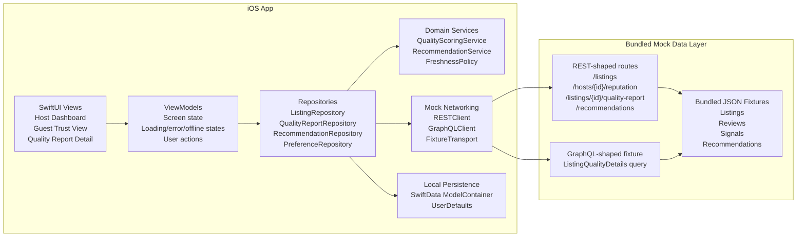
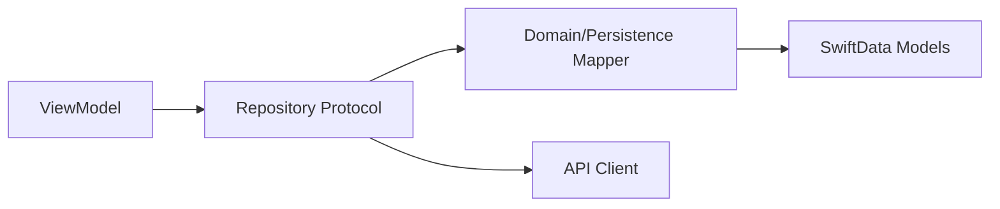
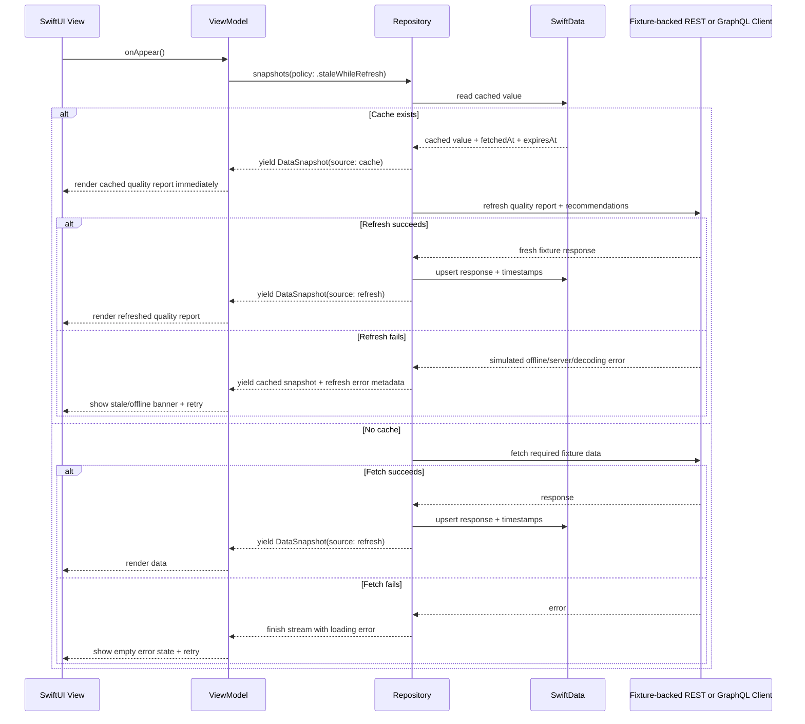
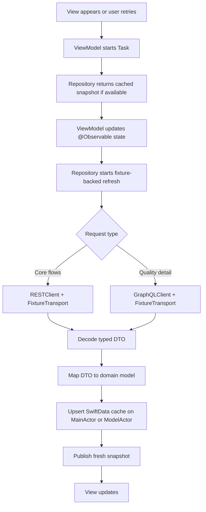

# ListingLens Architecture Document

Status: Draft  
Related PRD: [listinglens-prd.md](./listinglens-prd.md)  
MVP decisions: bundled JSON/mock data layer, iOS 17 Observation, iPhone-only.

## 1. Architecture Goals

ListingLens is an iOS portfolio app for listing quality, host reputation, and guest trust insights. The architecture should show strong iOS fundamentals without overbuilding the MVP.

Primary goals:

- Keep the app shippable quickly with SwiftUI, iOS 17 Observation, MVVM, async/await, SwiftData, and XCTest.
- Make host and guest experiences share the same underlying quality data while keeping their presentation logic separate.
- Support offline-friendly reads through SwiftData caching and stale-while-refresh behavior.
- Keep quality scoring and recommendations explainable, deterministic, and testable.
- Demonstrate REST and GraphQL data modeling through typed clients backed by bundled JSON fixtures.

Non-goals:

- No real Airbnb integration.
- No booking, payments, messaging, maps, or authentication.
- No production moderation, enforcement, or fraud decisioning.
- No production ML pipeline in the MVP.

## 2. System Overview

The app is organized around an iPhone-only SwiftUI client with Observation-based MVVM screens, domain services, repository abstractions, SwiftData persistence, and bundled JSON fixtures. REST-shaped routes support core list, host, report, signal, and recommendation flows. A GraphQL-shaped fixture is reserved for one listing quality detail screen to show practical exposure without turning the project into a GraphQL migration or backend project.



### Layer Responsibilities

| Layer | Responsibility | Examples |
| --- | --- | --- |
| Views | Render SwiftUI screens and reusable components. Keep business logic out. | `HostDashboardView`, `GuestTrustView`, `QualityScoreCard`, `StatusBadge` |
| ViewModels | Own screen state, async loading tasks, retry actions, cancellation, user intents, and first-screen prioritization. | `HostDashboardViewModel`, `GuestTrustViewModel`, `QualityReportViewModel` |
| Repositories | Coordinate local cache, remote fetches, freshness rules, and persistence. | `ListingRepository`, `QualityReportRepository` |
| Services | Encapsulate deterministic business rules and algorithms. | `QualityScoringService`, `RecommendationRankingService`, `FreshnessPolicy` |
| Networking | Execute typed REST-shaped and GraphQL-shaped requests against injectable fixture transport using async/await. | `RESTClient`, `GraphQLClient`, `FixtureTransport` |
| Persistence | Store cached structured data and lightweight app preferences. | SwiftData models, UserDefaults keys |

## 3. Client Module Plan

Recommended project structure:

```text
ListingLens/
  App/
    ListingLensApp.swift
    AppEnvironment.swift
  Features/
    HostDashboard/
    GuestTrust/
    QualityReport/
    Onboarding/
  SharedUI/
    QualityScoreCard.swift
    SignalBadge.swift
    LoadingStateView.swift
    OfflineBanner.swift
  Domain/
    Models/
    Services/
    Policies/
  Data/
    Networking/
    Persistence/
    Repositories/
  Resources/
    SeedPreviewData/
ListingLensTests/
```

`AppEnvironment` should construct dependencies once and inject repository protocols into ViewModels. This keeps previews and tests simple because each ViewModel can receive mocks or in-memory repositories.

Core protocols:

```swift
protocol ListingRepository {
    func listings(policy: FetchPolicy) -> AsyncThrowingStream<DataSnapshot<[Listing]>, Error>
    func listing(id: Listing.ID, policy: FetchPolicy) -> AsyncThrowingStream<DataSnapshot<Listing>, Error>
}

protocol QualityReportRepository {
    func qualityReport(for listingID: Listing.ID, policy: FetchPolicy) -> AsyncThrowingStream<DataSnapshot<QualityReport>, Error>
    func refreshQualityReport(for listingID: Listing.ID) async throws -> QualityReport
}

protocol RecommendationRepository {
    func recommendations(for listingID: Listing.ID, policy: FetchPolicy) -> AsyncThrowingStream<DataSnapshot<[Recommendation]>, Error>
    func markCompleted(_ id: Recommendation.ID) async throws
    func dismiss(_ id: Recommendation.ID) async throws
}
```

Repository methods that use `.staleWhileRefresh` return an `AsyncThrowingStream` because they may emit a cached snapshot immediately and a refreshed network snapshot later. One-shot methods such as explicit pull-to-refresh can still use `async throws`.

`DataSnapshot<T>` should carry both data and metadata so the UI can explain freshness:

```swift
struct DataSnapshot<Value> {
    let value: Value
    let source: DataSource
    let fetchedAt: Date?
    let isStale: Bool
    let isOfflineFallback: Bool
    let refreshError: Error?
}
```

## 4. Domain Model Overview

The domain layer should use plain Swift types that are independent of SwiftData and network DTOs. This avoids coupling UI and scoring logic to persistence implementation details.

Core domain models:

- `Listing`: listing identity, title, location summary, host ID, image URL, summary quality metadata.
- `Host`: host identity, reputation summary, response time, cancellation reliability.
- `Review`: normalized review text, rating, date, optional extracted themes.
- `QualitySignal`: category, severity, source, date, explanation, evidence count.
- `QualityReport`: overall score, category scores, trends, risk signals, positive signals, accessibility completeness, confidence level, and data completeness.
- `CategoryScore`: category value, weighted contribution, explanation, confidence level, evidence count, and data completeness.
- `Recommendation`: title, host action, evidence signals, expected impact, confidence, status, and claim type.
- `QualityBadge`: guest-facing trust badge with visible explanation, evidence, and claim type.
- `PrimaryInsight`: first-screen summary derived from the highest-priority risk, recommendation, or positive signal.
- `ClaimType`: whether a claim is `verified`, `hostProvided`, `guestReported`, or `inferred`.
- `ConfidenceLevel`: `high`, `medium`, `low`, or `insufficientData`.

DTOs should live under `Data/Networking/DTOs`. SwiftData models should live under `Data/Persistence/Models`. Each has mapping functions to and from domain models.

## 5. Quality Scoring and Recommendations

The scoring engine is deterministic in the MVP. It should not call the network or read directly from SwiftData. It accepts normalized signals and returns a score object with explanations.

Suggested score weights from the PRD:

| Category | Weight |
| --- | ---: |
| Cleanliness | 20% |
| Check-in reliability | 20% |
| Accuracy | 15% |
| Communication | 15% |
| Cancellation reliability | 10% |
| Safety signals | 10% |
| Accessibility completeness | 10% |

These are heuristic MVP weights selected for explainability. They should be visible in documentation and tests, but the UI should avoid implying they are statistically validated production weights. The scoring service should also return confidence and data completeness metadata so sparse listings do not appear more certain than the evidence supports.

Recommendation ranking should prioritize:

1. Severity: safety and check-in blockers rank above cosmetic issues.
2. Frequency: repeated guest issues rank above isolated reports.
3. Recency: recent declines rank above old resolved problems.
4. Confidence: recommendations with stronger evidence rank higher.
5. Expected impact: actions likely to improve guest experience rank higher.

The MVP "AI Quality Coach" should be a deterministic adapter that produces AI-style summaries from quality signals. It should expose an interface that can later be backed by a real LLM without changing ViewModels.

```swift
protocol QualityCoach {
    func recommendations(from report: QualityReport, reviews: [Review]) async throws -> [Recommendation]
}
```

The adapter must not emit a recommendation unless it can attach at least one evidence signal. It should also set a `claimType` so the UI can distinguish verified facts, host-provided information, guest-reported patterns, and inferred summaries.

### Presentation Prioritization

The domain model can be rich, but the first screen should stay focused. ViewModels should derive presentation-specific summaries from the full domain payload:

- `HostDashboardViewModel` derives `primaryInsight` from the highest-priority risk or recommendation.
- Host first screen shows one primary metric, one primary risk, and one primary action before secondary details.
- `GuestTrustViewModel` derives a concise trust summary, strongest positive signal, and strongest caution signal.
- Guest first screen shows trust summary, check-in reliability, accessibility completeness, and one strongest positive or caution signal.
- Detailed score breakdowns, review themes, and full evidence lists belong in drill-down sections.

This keeps the architecture technically complete while preventing the UI from presenting every metric at equal weight.

## 6. Local Persistence Strategy

Use SwiftData for structured local state and UserDefaults for simple preferences.

### SwiftData Responsibilities

SwiftData should store data that has relationships, timestamps, user state, or offline value:

- Cached listing summaries.
- Cached listing quality reports.
- Cached host reputation summaries.
- Cached recommendation cards.
- Dismissed and completed recommendation state.
- Saved listings.
- Cache metadata such as `fetchedAt`, `expiresAt`, `schemaVersion`, and `lastFetchStatus`.

Recommended SwiftData models:

```swift
@Model
final class CachedListing {
    @Attribute(.unique) var id: String
    var title: String
    var hostID: String
    var locationSummary: String
    var thumbnailURL: URL?
    var overallScore: Int?
    var fetchedAt: Date
    var expiresAt: Date
}

@Model
final class CachedQualityReport {
    @Attribute(.unique) var listingID: String
    var payloadData: Data
    var fetchedAt: Date
    var expiresAt: Date
    var lastSuccessfulRefreshAt: Date?
    var schemaVersion: Int
}

@Model
final class CachedRecommendation {
    @Attribute(.unique) var id: String
    var listingID: String
    var payloadData: Data
    var statusRawValue: String
    var fetchedAt: Date
    var completedAt: Date?
    var dismissedAt: Date?
}

@Model
final class SavedListing {
    @Attribute(.unique) var listingID: String
    var savedAt: Date
}
```

For the MVP, storing `QualityReport` and `Recommendation` payloads as encoded `Data` is acceptable if the app does not need complex local queries across nested fields. Listing summaries should use explicit columns because they power fast dashboard rendering and list filtering.

Because `QualityReport` payloads include confidence, data completeness, claim type, and evidence metadata, repositories should invalidate or migrate cached payloads when `schemaVersion` changes.

### UserDefaults Responsibilities

Use UserDefaults only for lightweight, non-relational preferences:

- Onboarding completion.
- Selected persona: host or guest.
- Last active tab.
- Developer mode toggle.
- Preferred demo listing ID.

UserDefaults should not store quality reports, recommendations, or cached API responses.

### Repository Boundary

ViewModels should not import SwiftData directly. Repositories own SwiftData access and expose domain models. This keeps persistence swappable if the project later replaces SwiftData with Core Data for older iOS support.



### Cache Freshness Policy

Use a central `FreshnessPolicy` so all screens make consistent freshness decisions.

Recommended TTLs:

| Data Type | Freshness Window | Rationale |
| --- | ---: | --- |
| Listing summaries | 15 minutes | Keeps dashboard/list data responsive without frequent fetches. |
| Quality reports | 30 minutes | Quality signals are important but not real time in the MVP. |
| Host reputation | 30 minutes | Usually changes with reviews and issue history, not second by second. |
| Recommendations | 30 minutes | Should update after report refresh or user action. |
| User completion/dismissal state | No TTL | User action state should persist until changed. |

## 7. Stale-While-Refresh Offline Support

The app should use stale-while-refresh for cached quality reports. This is the core trust and safety interaction: the user sees the last known quality state immediately while the latest recommendation and safety-signal refresh runs in the background.

1. Try to read cached data from SwiftData immediately.
2. If cached data exists, yield it through the repository stream right away.
3. Mark the snapshot as fresh or stale based on `expiresAt`.
4. Start a fixture-backed remote refresh in the same async task, including any simulated AI safety or recommendation check.
5. If refresh succeeds, persist the new response and yield a fresh snapshot.
6. If refresh fails, yield the cached snapshot again with `refreshError` metadata and surface a non-blocking stale/offline state.
7. If no cache exists and the fixture fetch fails, finish the stream with an error so the UI can show a blocking retry state.

This makes the app usable offline while still keeping trust information current when possible. Cached data is visible but labeled; the app should never hide the entire quality report just because the latest safety check is still loading.



### UI States for Stale Data

The UI should distinguish three states:

- Fresh cached or network data: no warning required.
- Stale cached data while refresh is running: show "Showing saved quality report. Refreshing latest safety signals..." until refresh completes.
- Stale cached data while offline or after refresh failure: show "Offline. Showing saved quality report from {time}." with a retry affordance.

Do not block the host or guest from reading cached quality reports just because the data is stale or the latest AI-style recommendation check is still running. Staleness should be visible, not fatal.

### Conflict Rules

User actions should be handled carefully while offline:

- Completing or dismissing recommendations can be saved locally immediately.
- These actions do not need server sync for the MVP unless a backend mutation is implemented.
- If server sync is added later, queue local mutations with a `pendingSync` flag and retry when online.
- Network refreshes must not overwrite local completion or dismissal state. Merge remote recommendation content with local user status by recommendation ID.

## 8. Async Networking Flow

Use Swift concurrency throughout the app.

### Request Flow



### ViewModel Task Ownership

Each ViewModel should own its active `Task` and cancel it when the screen disappears or when a newer request supersedes an older one.

```swift
@MainActor
@Observable
final class HostDashboardViewModel {
    private(set) var state: Loadable<HostDashboardState> = .idle
    private var loadTask: Task<Void, Never>?

    func load() {
        loadTask?.cancel()
        loadTask = Task {
            do {
                state = .loading
                for try await snapshot in repository.dashboardSnapshots(policy: .staleWhileRefresh) {
                    try Task.checkCancellation()
                    state = .loaded(HostDashboardState(snapshot: snapshot))
                }
            } catch is CancellationError {
                return
            } catch {
                state = .failed(error)
            }
        }
    }

    func cancel() {
        loadTask?.cancel()
    }
}
```

The MVP targets iOS 17, so ViewModels should use Swift Observation. The important rule is that UI state changes happen on the main actor, while fixture loading, decoding, scoring, and refresh work stay off the main thread where practical.

### Error Types

Define typed errors so ViewModels can show correct UI:

```swift
enum APIError: Error {
    case invalidURL
    case transport(URLError)
    case server(statusCode: Int, body: Data?)
    case decoding(DecodingError)
    case emptyResponse
}

enum RepositoryError: Error {
    case noCachedData
    case refreshFailed(cachedSnapshotAge: TimeInterval, underlying: Error)
}
```

### REST-Shaped Routes

Core REST-shaped fixture routes:

- `GET /v1/listings`
- `GET /v1/listings/{id}/quality-report`
- `GET /v1/hosts/{id}/reputation`
- `POST /v1/quality/signals`
- `POST /v1/recommendations/interventions`

REST-shaped fixture routes should power the host dashboard, guest trust view, listing list, host reputation summary, and recommendation refresh.

### GraphQL Query

The GraphQL-shaped fixture should power only the quality report detail screen:

```graphql
query ListingQualityDetails($listingId: ID!) {
  listing(id: $listingId) {
    id
    title
    qualityReport {
      overallScore
      confidenceLevel
      dataCompleteness
      scoreBreakdown {
        category
        score
        weight
        weightedContribution
        explanation
      }
      riskSignals {
        id
        category
        severity
        claimType
        title
        explanation
      }
      positiveSignals {
        id
        category
        claimType
        title
        explanation
      }
    }
  }
}
```

## 9. Feature Data Flows

### Host Dashboard

1. ViewModel asks `ListingRepository` for selected listing summary.
2. ViewModel asks `QualityReportRepository` for the listing quality report with `.staleWhileRefresh`.
3. Repository returns cached report immediately if available.
4. ViewModel derives the primary insight, top risk, and primary recommended action from the full report.
5. View renders the first-screen summary and places additional signals in secondary sections.
6. Repository refreshes quality report and recommendations.
7. ViewModel updates the dashboard when fresh data arrives.
8. Host can dismiss or complete recommendations; repository persists that local state in SwiftData.

### Guest Trust View

1. ViewModel loads listing, host reputation, quality badges, review themes, and accessibility completeness.
2. ViewModel derives the trust summary, strongest positive signal, and strongest caution signal.
3. Cached data renders first when present.
4. Remote refresh updates reliability indicators and recent trend warnings.
5. Badge explanations are generated from visible quality signals, not hidden scoring internals.
6. Badges expose claim type so the UI can distinguish verified, host-provided, guest-reported, and inferred claims.

### Quality Report Detail

1. ViewModel requests listing quality details from `QualityReportRepository`.
2. Repository reads cached report for immediate display.
3. Repository uses `GraphQLClient` to refresh the detailed report.
4. Response maps into `QualityReport`.
5. SwiftData cache updates with the full report payload and timestamps.

## 10. Accessibility Architecture

Accessibility should be a first-class part of shared UI components rather than a cleanup pass.

Implementation rules:

- Score cards expose labels like "Quality score, 84 out of 100, high confidence, improving."
- Badges include text and icon/status shape, not color alone.
- Charts include concise summaries for VoiceOver instead of requiring point-by-point exploration.
- Dynamic Type should be supported on all primary screens.
- Tap targets should stay at least 44 by 44 points.
- Accessibility completeness must be clearly labeled as host-provided or unverified when appropriate.
- Status copy should avoid unsupported absolute claims such as "safe," "unsafe," "bad host," or "fully accessible."

Shared components should accept accessibility strings from domain explanations so the same evidence powers visual and VoiceOver presentation.

## 11. Testing Strategy

### Unit Tests

Required:

- `QualityScoringServiceTests`: verifies weights, category scores, trend impact, and explanation output.
- `QualityScoringConfidenceTests`: verifies sparse data behavior, confidence levels, data completeness, and evidence counts.
- `RecommendationRankingServiceTests`: verifies severity, frequency, recency, confidence, and impact ordering.
- `QualityCoachTests`: verifies recommendations are not generated without evidence signals and include claim type.
- `FreshnessPolicyTests`: verifies fresh, stale, expired, and missing-cache decisions.
- `RESTClientTests`: verifies success, server error, timeout, decoding error, and empty response.
- `RepositoryTests`: verifies cache hit, stale-while-refresh success, stale-while-refresh failure, and no-cache failure.

### UI Tests

Target the portfolio demo path:

1. Host opens dashboard and sees cached or loaded quality score.
2. Host sees one primary insight before drilling into full risk signals.
3. Host completes a recommendation and sees state persist.
4. Guest opens trust view and reads badge explanations with claim type language.
5. App launches offline and renders cached report with stale/offline label.

### Test Infrastructure

Use:

- In-memory SwiftData `ModelContainer` for repository tests.
- Custom `URLProtocol` or injected transport for API client tests.
- Seeded JSON fixtures for stable decoding tests.
- Deterministic dates through a `Clock` or `DateProvider` abstraction.

## 12. Implementation Sequence

Recommended build order:

1. Define domain models, scoring service, confidence/data completeness metadata, recommendation ranking, and unit tests.
2. Add bundled JSON fixtures and fixture transport with seeded data.
3. Build REST client and DTO mapping.
4. Add SwiftData models and repositories.
5. Implement stale-while-refresh loading for listing summaries and reports.
6. Build Host Dashboard with primary insight and progressive disclosure.
7. Build Guest Trust View with claim type language and progressive disclosure.
8. Add GraphQL quality detail query and Quality Report Detail screen.
9. Add deterministic AI Quality Coach adapter with evidence and claim type requirements.
10. Add offline banners, retry actions, and accessibility polish.
11. Add UI tests and documentation polish.

This order keeps the highest-risk technical pieces testable before the UI is fully polished.

## 13. Key Architecture Decisions

| Decision | Choice | Reason |
| --- | --- | --- |
| UI architecture | MVVM | Familiar SwiftUI pattern, simple to test, strong portfolio signal. |
| Persistence | SwiftData + UserDefaults | Modern iOS persistence for structured cache, simple preferences separated. |
| Networking | REST-shaped fixtures + one GraphQL-shaped query | Matches job requirements while avoiding backend setup and keeping scope controlled. |
| AI | Deterministic adapter in MVP | Testable, explainable, no API key or cost dependency. |
| Offline support | Stale-while-refresh | Fast cached reads, graceful network failure handling, clear offline UX. |
| Scoring | Local deterministic service with confidence metadata | Transparent, unit-testable, easy to explain without implying production statistical validity. |
| Presentation | Progressive disclosure | Keeps first screens focused while preserving drill-down evidence and technical depth. |

## 14. Resolved Technical Decisions

- Project name: ListingLens.
- Data source: bundled JSON fixtures with injectable fixture transport.
- State management: iOS 17 Observation.
- MVP form factor: iPhone-only.
- Recommendation mutations: local-only in SwiftData for MVP.

Rationale:

- These choices remove backend, iPad, and deployment overhead.
- The app still demonstrates high-quality engineering through clean data boundaries, async refresh flows, SwiftData persistence, offline behavior, tests, and accessibility.
- The MVP stays focused on the Quality Reputation story needed for the job application.
